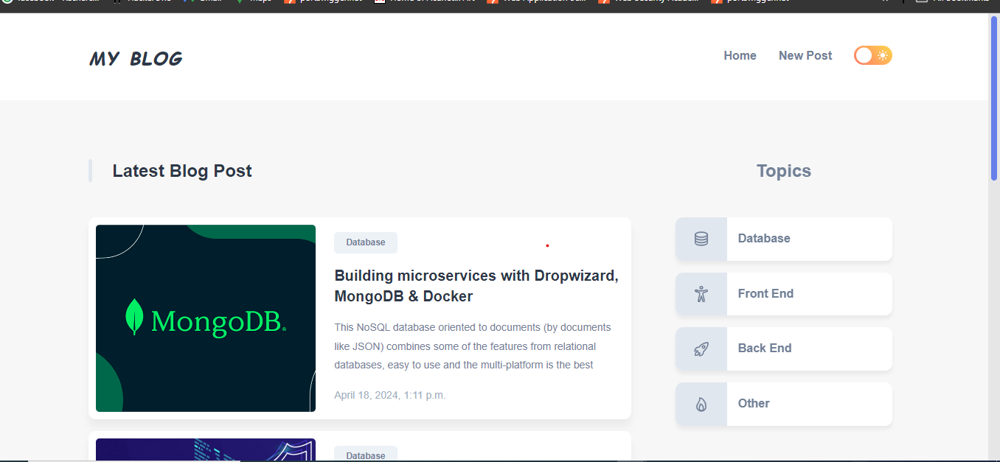
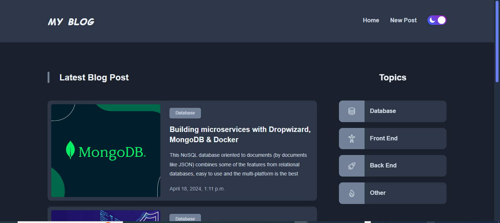
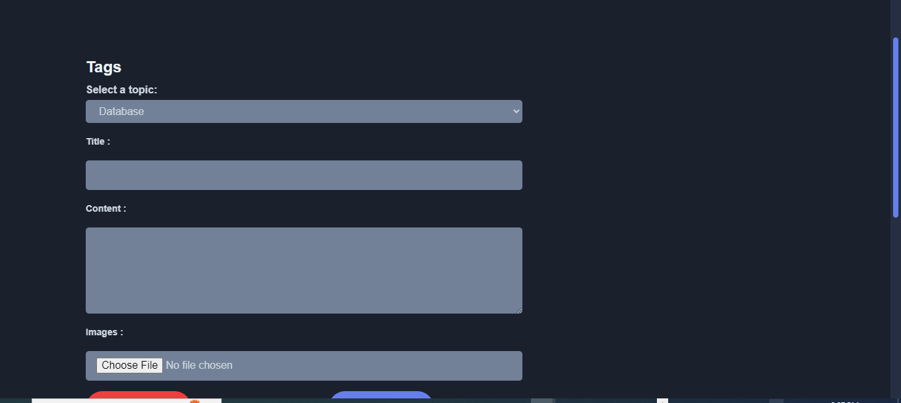
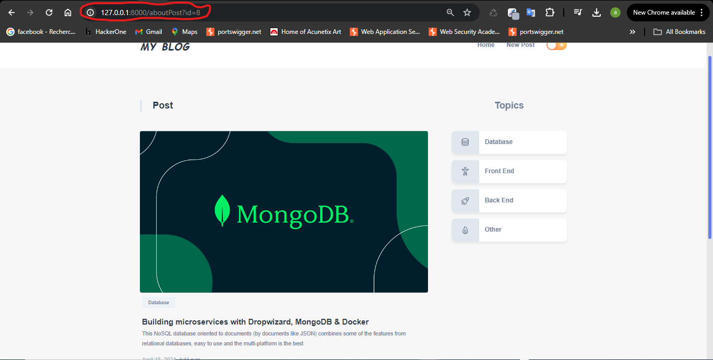

  # Blog Application

This is a Django-based MVC blog application where users can create, and view blog posts. The application follows the MVC (Model-View-Controller) architectural pattern for organizing its components.

# Developed with

**Front end :** HTML, CSS 

**Back end :** python (Django) 

**Database :** MYSQL

# Navigating the Application

* Home Page: The home page displays a list of all blog posts. Users can click on a post to view its details.

* Create Post: Users can create a new blog post by clicking on the "newPost" .

* View Post: Clicking on a post title will take the user to a detailed view of the post.

## Installation

1: Clone the repository to your local machine: git clone <repository-url>

2: Navigate to the project directory: cd <project-directory>
 
3: Install the required dependencies: pip install -r requirements.txt

## Database Setup
1: Make migrations for the database: python manage.py makemigrations

2: Apply the migrations to create the database schema: python manage.py migrate

## running the Application
 Start the development server:  python manage.py runserver

